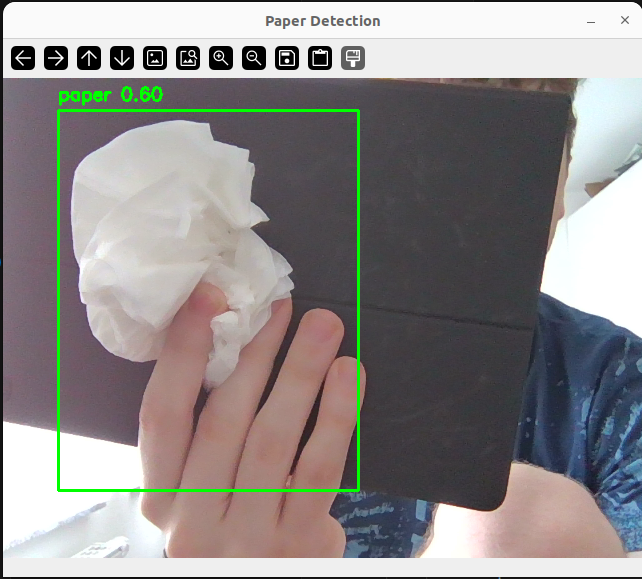

# Self-Propelled Arm System
___

## Install First

- Python 3
- Git
- A webcam or USB camera

## Setup

```bash
python3 -m venv .venv
source .venv/bin/activate
pip install -r requirements.txt
```

## Train Paper Model

 **NVIDIA RTX 3060 Laptop GPU (~6 GB VRAM) and 32 GB RAM**.
On that machine install the CUDA build of PyTorch instead of the default requirements:

```bash
pip install -r requirements-gpu.txt
```

Run (defaults to GPU `0`):

```bash
python train_paper.py
```

`train_paper.py` defaults: `--device 0` (CUDA), `--batch 16` (for 6 GB VRAM  `--imgsz 416`;
try `24`-`32`, or `-1`), `--cache ram`. Force CPU with `--device cpu`.

Stop:

```bash
Ctrl+C
```

## Run Detection Test

Run:

```bash
python test_detection.py
```

Example:



Stop:

Press `q` in the camera window.

## Auto-Label New Images

Pre-label new images with the trained model, then review before training.

Add images to `new_data/images/`, then run:

```bash
python autolabel.py
```

Draft labels go to `new_data/labels/` and previews to `new_data/preview/`. 
Review and fix the labels in **labelImg**. This script auto-creates `classes.txt` and opens labelImg on the new images:

```bash
python label_data.py
```

In labelImg, click the format button on the left toolbar until it says **YOLO**, then add/move/delete boxes and save.

When you close labelImg, the previews in `new_data/preview/` refresh to match your edits. To redraw them manually anytime model-free, never changes your labels:

```bash
python render_labels.py
```

Then merge and retrain. `--val-frac` is required. it's the fraction of new images held back for validation (`0.2` = 20% recommended):

```bash
python add_reviewed_data.py --val-frac 0.2 
python train_paper.py
```
