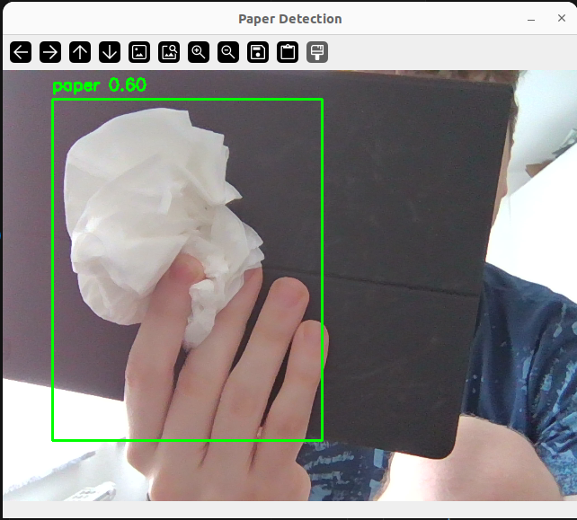
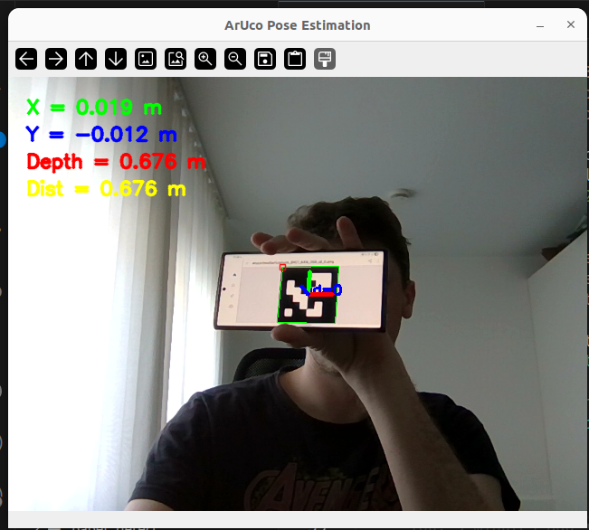

# Self-Propelled Arm System
___

## Documentation

The complete technical report can be found here:

[📄 Download the Final Report (PDF)](FINAL_REPORT.pdf)

## Labeled images for FT
[see google doc link](https://drive.google.com/drive/folders/1hPvIm-8g-z-UAHF-hwR392S8lAuq4Fpj?usp=drive_link) Might require more manual filtering.

## Plans

- [Detailed Project Plan](Detailed%20Project%20Plan.md)
- [Trello Todo List](https://trello.com/b/hB05vBUY/cps-project)

## Integration demo code
- [Demo Updated 16/6](https://github.com/kamkanev/Self-Propelled-Arm-System/blob/6afc67ae811cf1699f24ac46ae672f4a9c25f5da/robot_code/demo/depthnet_servo_decision_demo.ipynb)

## Install First

- Python 3
- Git
- A webcam or USB camera

## Setup

```bash
python3 -m venv .venv
source .venv/bin/activate
pip install -r requirements.txt
```

## Train Paper Model

 **NVIDIA RTX 3060 Laptop GPU (~6 GB VRAM) and 32 GB RAM**.
On that machine install the CUDA build of PyTorch instead of the default requirements:

```bash
pip install -r requirements-gpu.txt
```

Run (defaults to GPU `0`):

```bash
python train_paper.py
```

`train_paper.py` defaults: `--model yolo11n.pt` (nano model sized to run in real time on the
JETANK's Jetson Nano 4 GB), `--imgsz 416`, `--device 0` (CUDA), `--batch -1` (auto-fit VRAM),
`--cache ram`. Force CPU with `--device cpu`. The script copies the best weights to `best.pt`,
which is what the robot loads for inference.

Stop:

```bash
Ctrl+C
```

## Run Detection Test

Run:

```bash
python test_detection.py
```

Example:



Stop:

Press `q` in the camera window.

## Run ArUco Depth detection

Before running ArUco detection, calibrate your camera first. See [aruco/README.md](aruco/README.md) for full calibration and setup instructions to generatew the required YAML file.

From the repository root, run the ArUco detection script from the `aruco/` folder:

```bash
cd aruco
python3 aruco_detection.py
```



These scripts require a generated camera calibration YAML file and the physical ArUco marker size in millimeters.

## Auto-Label New Images

Pre-label new images with the trained model, then review before training.

Add images to `new_data/images/`, then run:

```bash
python autolabel.py
```

Draft labels go to `new_data/labels/` and previews to `new_data/preview/`. 
Review and fix the labels in **labelImg**. This script auto-creates `classes.txt` and opens labelImg on the new images:

```bash
python label_data.py
```

In labelImg, click the format button on the left toolbar until it says **YOLO**, then add/move/delete boxes and save.

When you close labelImg, the previews in `new_data/preview/` refresh to match your edits. To redraw them manually anytime model-free, never changes your labels:

```bash
python render_labels.py
```

Then merge and retrain. `--val-frac` is required. it's the fraction of new images held back for validation (`0.2` = 20% recommended):

```bash
python add_reviewed_data.py --val-frac 0.2 
python train_paper.py
```
