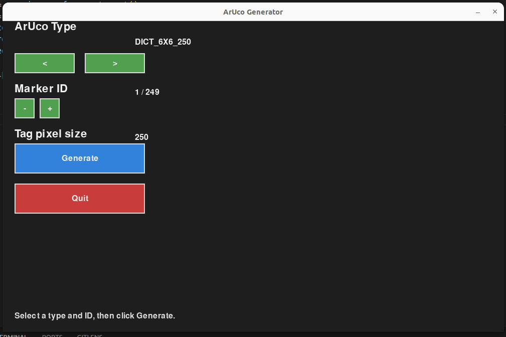
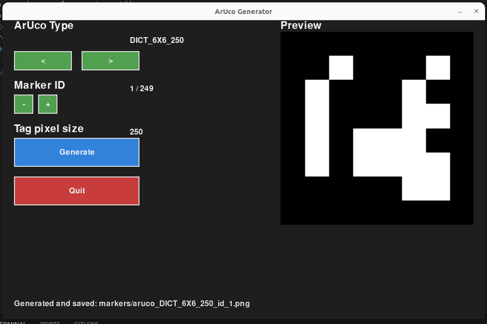

# ArUco Marker Generator

This folder contains tools to generate ArUco and AprilTag markers using OpenCV.

## Requirements

- Python
- `numpy`
- `opencv-python` or an OpenCV build with the `aruco` module
- `pygame` for the GUI generator (required to run `gui_generator.py`)

Install dependencies with pip, for example:

```bash
pip install numpy opencv-python pygame
```

## Scripts

### `aruco_generator.py`

Use this script to generate markers from the command line.

- Change `aruco_type`, `tag_size`, and `id` inside the script to produce different markers.
- Run:

```bash
python3 aruco_generator.py
```

This will generate a marker and save it to the `markers/` folder.

### `gui_generator.py`

Use this script to generate markers with a simple GUI.

- Run:

```bash
python3 gui_generator.py
```

- Use the GUI controls to select `aruco_type`, change the marker `id`, and generate the marker.
- The generated marker is previewed in the window and saved to `markers/`.

## Output

Generated markers are saved in the `markers/` folder.

## Screenshots

Screenshots of the GUI are available in the repository `screenshots/` folder:

- `screenshots/aruco_gen_init.png` — initial generator view.
- `screenshots/aruco_gen_ready.png` — preview and generated marker state.
- `screenshots/detection.png` — example output from detection.





> Note: The GUI version is the easiest way to create markers without editing the script directly.
