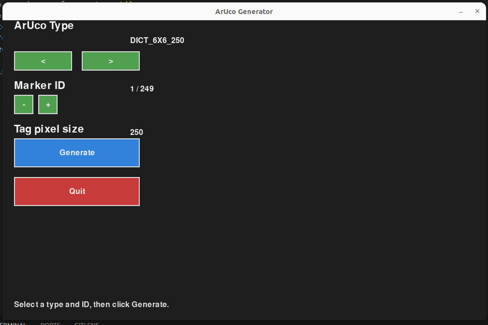
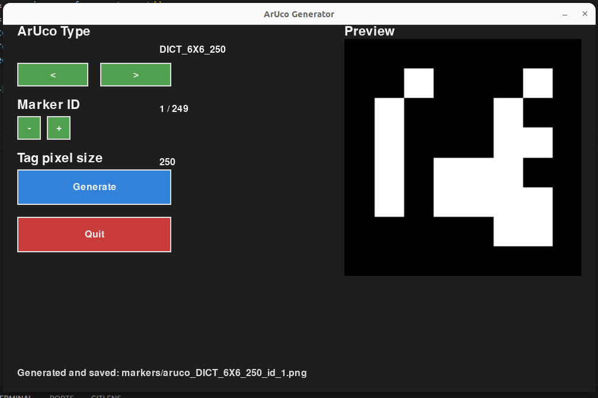
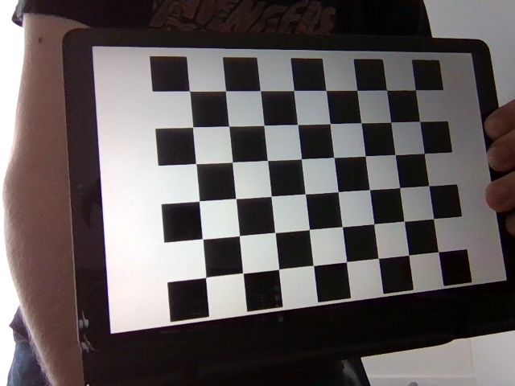
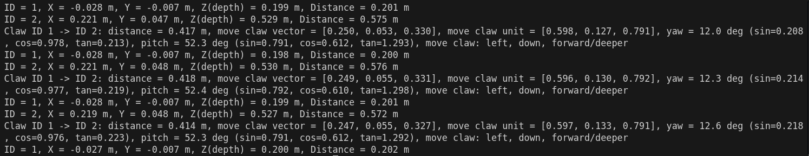
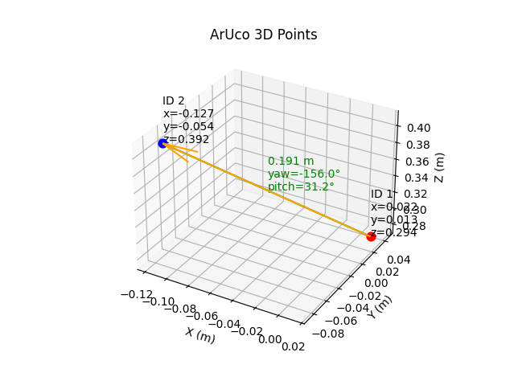

# ArUco Marker Generator

This folder contains tools to generate ArUco and AprilTag markers using OpenCV.

## Requirements

- Python
- `numpy`
- `opencv-python` or an OpenCV build with the `aruco` module
- `pygame` for the GUI generator (required to run `gui_generator.py`)

Install dependencies with pip, for example:

```bash
pip install numpy opencv-python pygame
```

## Scripts

### `aruco_generator.py`

Use this script to generate markers from the command line.

- Change `aruco_type`, `tag_size`, and `id` inside the script to produce different markers.
- Run:

```bash
python3 aruco_generator.py
```

This will generate a marker and save it to the `markers/` folder.

### `gui_generator.py`

Use this script to generate markers with a simple GUI.

- Run:

```bash
python3 gui_generator.py
```



- Use the GUI controls to select `aruco_type`, change the marker `id`, and generate the marker.
- The generated marker is previewed in the window and saved to `markers/`.



### Calibration

Both `aruco_detection.py` require camera calibration first.

- Run `calibration.py` with the provided `chessboard.jpeg` example to capture calibration images.
- Collect at least 15 different chessboard screenshots, similar to the one below
- Then run the `generate_calib_file.py` to create the YAML calibration file.
- Keep the generated YAML file available when running detection or pose estimation.
- Also know the physical size of the ArUco marker in millimeters.
  


### `aruco_detection.py`

This script detects ArUco markers and estimates their position in the camera image.

- It captures frames from the camera.
- Detects markers using the supported OpenCV `ArucoDetector` API.
- Computes centroids and approximate distance-based position information.
- Requires a valid camera calibration file and the physical marker size.

### `triangluate.py`

`triangluate.py` is used to triangulate the distance between the `claw_id` (which can be set inside the file) and all other ArUco marker IDs detected in the scene. It computes and prints, for each target marker relative to the claw marker:

- The 3D distance between markers (meters).
- A direction/move vector and its unit vector.
- Yaw and pitch values (degrees) and their sine, cosine, and tangent values.



These values are produced by the helper functions in `plot_3d_points.py` and are useful for guidance logic (for example, moving a claw toward a marker). `triangluate.py` imports and uses `plot_3d_points.py` to render a live 3D visualization of the marker positions for easier understanding and debugging; the plotting can be disabled by commenting out the plotting code or setting the plotting flag (e.g. `ENABLE_3D_PLOT = False`) in the script.



### Positions

Rounded position limitations that work for normal camera and 4x4 codes.
*(0,0) is center of the camera.*

- X: from around 0.500 m to -0.500 m
- Y: from around 0.500 m to -0.500 m
- Z: from around 0 m to 1.0 m

