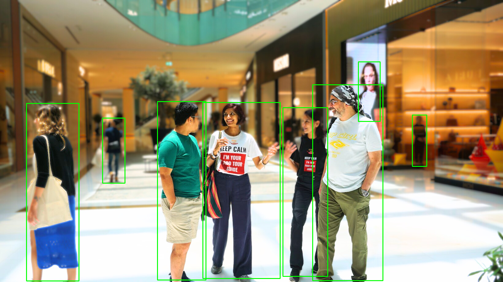
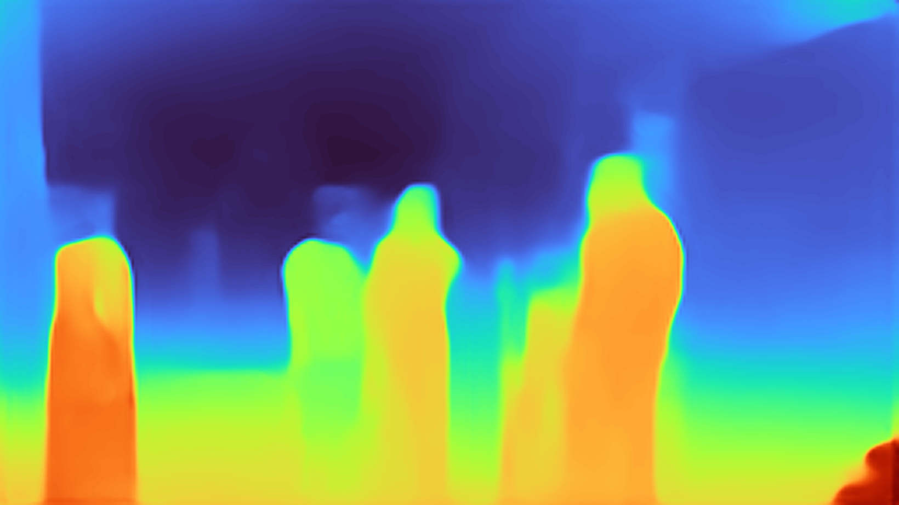
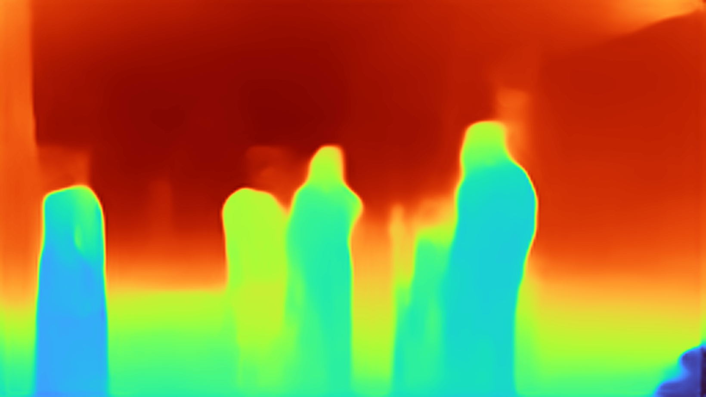
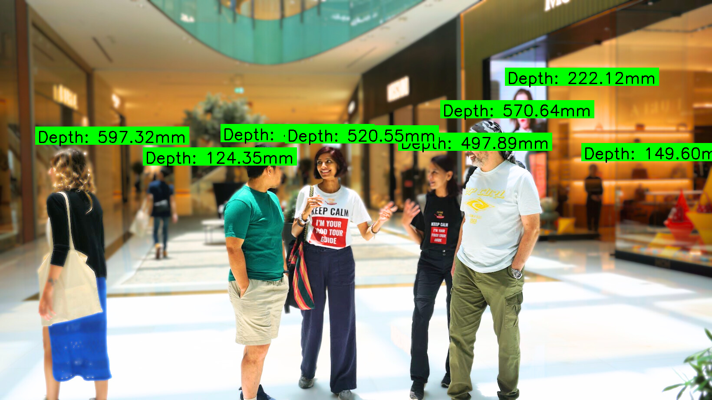

# Depth Folder Usage

This folder contains two example scripts for running MiDaS depth estimation and YOLO object detection together.

## Files

- `test_depth.py`
  - Runs YOLO detection on a static image (`data/dubai.png`).
  - Loads the YOLO model from the main project folder at `../yolo11s.pt`.
  - Runs MiDaS depth estimation on the same image.
  - Displays the YOLO detection image, the depth colormap, and an inverted depth colormap.
  - Saves the following outputs:
    - `output_detection.png`
    - `output_depth.png`
    - `output_depth_inverted.png`
    - `output_detection_with_distance.png`

- `depth_perseption.py`
  - Opens a camera feed and runs MiDaS depth estimation on each frame.
  - Loads the YOLO model from the main project folder at `../yolo11s.pt` (can be changed to `../best.pt` or something else).
  - Draws YOLO boxes on live frames.
  - Displays both the camera view and the MiDaS depth preview.

## How to run

From the `depth/` folder, activate your environment and run:

```bash
python test_depth.py
```

On the first run, the MiDaS model files will be downloaded into the local cache directory. You may need to confirm the download prompt in the terminal before the script continues.

Then run the camera demo:

```bash
python depth_perseption.py
```

If you want to choose a specific camera or MiDaS model, use:

```bash
python depth_perseption.py --camera 0 --model MiDaS_small --device auto
```

## Showcase

The example outputs saved by `test_depth.py` include:

### Detection output



### Depth output



### Inverted depth output



### Detection with distance



> Note: image previews work when viewed in a Markdown viewer that supports local image rendering.
